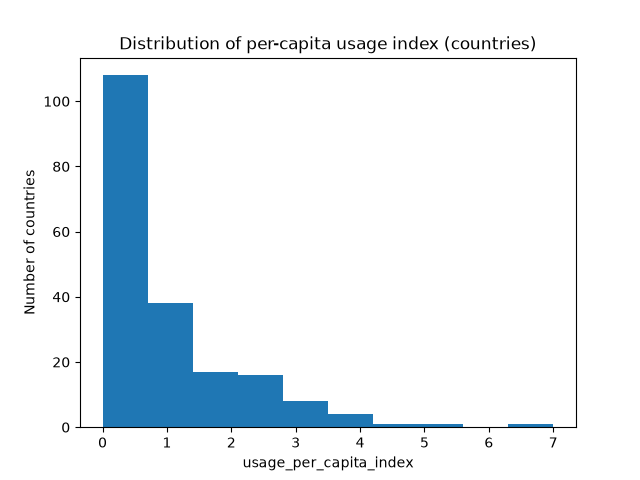
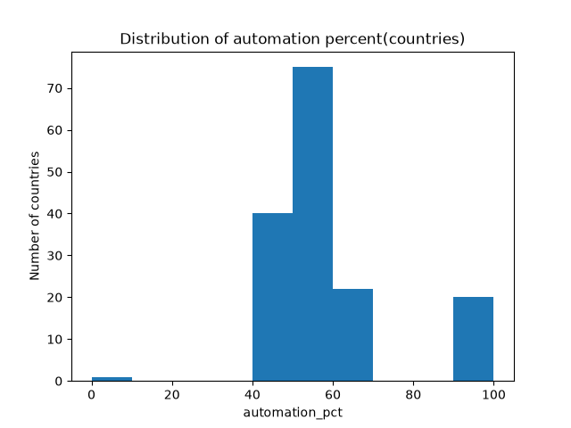
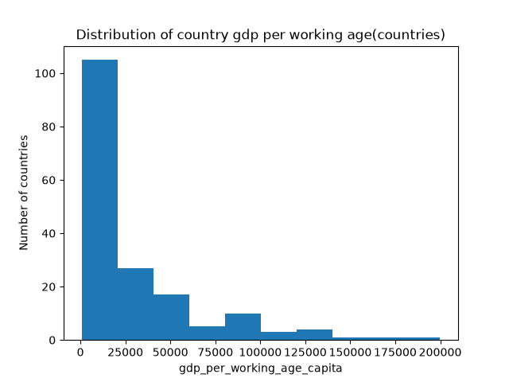

# Exploratory Profile

## Per-capita usage index (adoption outcome)

There is a strong right-skew in this histogram, with a majority of countries being under the usage_per_capita_index of 1. 
There is a long tail with Israel being the only country near 7. A transformation may be needed before modeling it.

## Automation vs augmentation (behavioral outcome)

A majority of countries sit between 40% and 60% automation. With a few sitting at 100% such as Guyana, Burundi, Chad, Sierra Leone, and others. Andorra sits at 0, being the only country with a 0% automation. Mostly it is central but with some outliers due to low-usage from countries.

## GDP per working-age capita (key predictor)

Over 100 countries have a gdp below 25,000. This makes the histogram strongly right skewed, similar to the per capita usage index. 
The long tail includes countries such as Luxembourg, Ireland, Switzerland, and the United States.